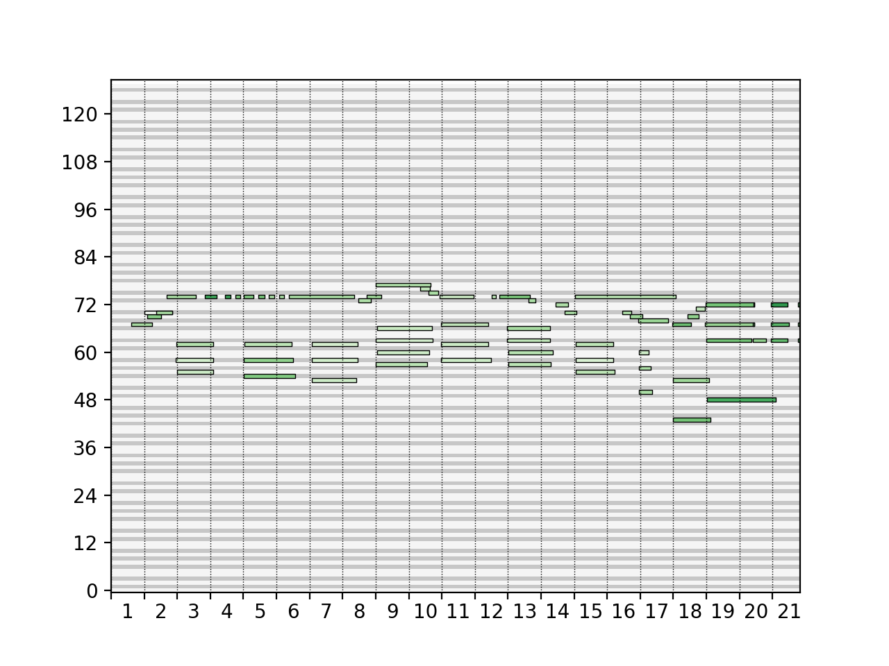
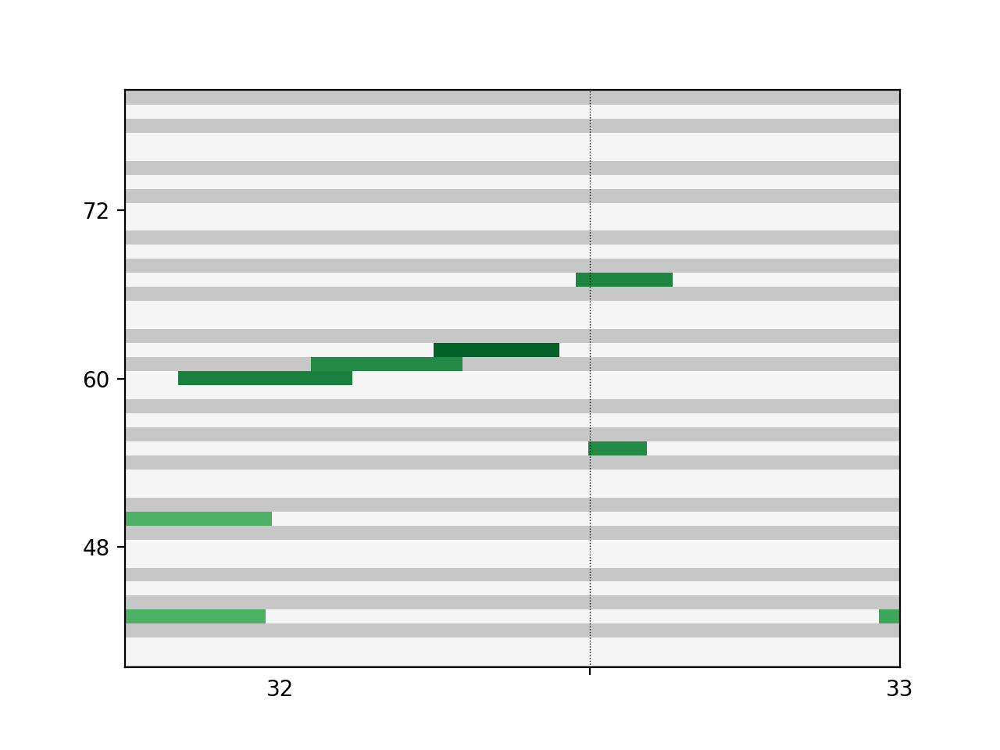
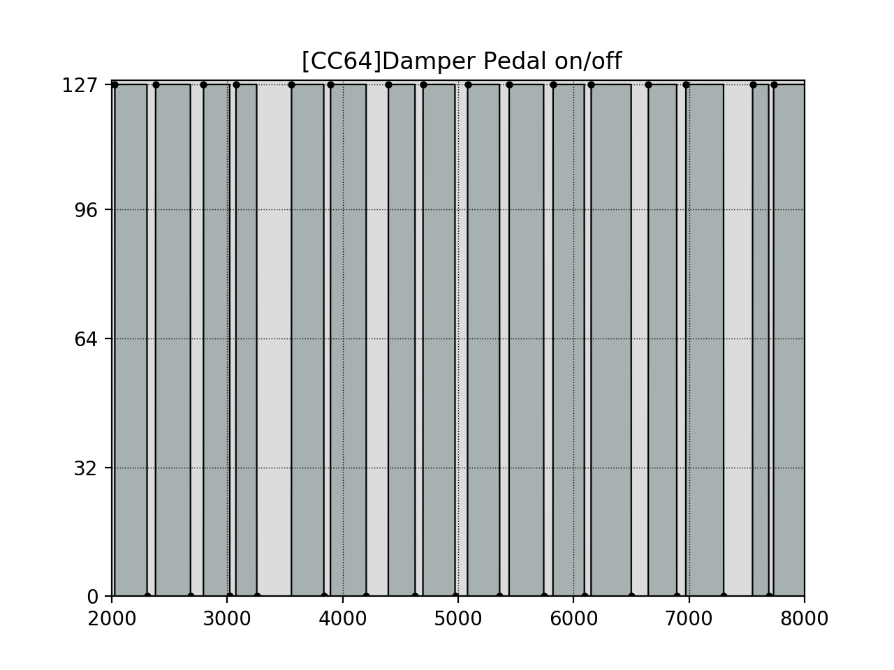

# midi2painoroll

Python package for Midi to pianoroll conversion and visualization.
Note: It is still a **beta version**!

## Usage

You can run the 'main.py' scrpit directly 

## Sample Result

