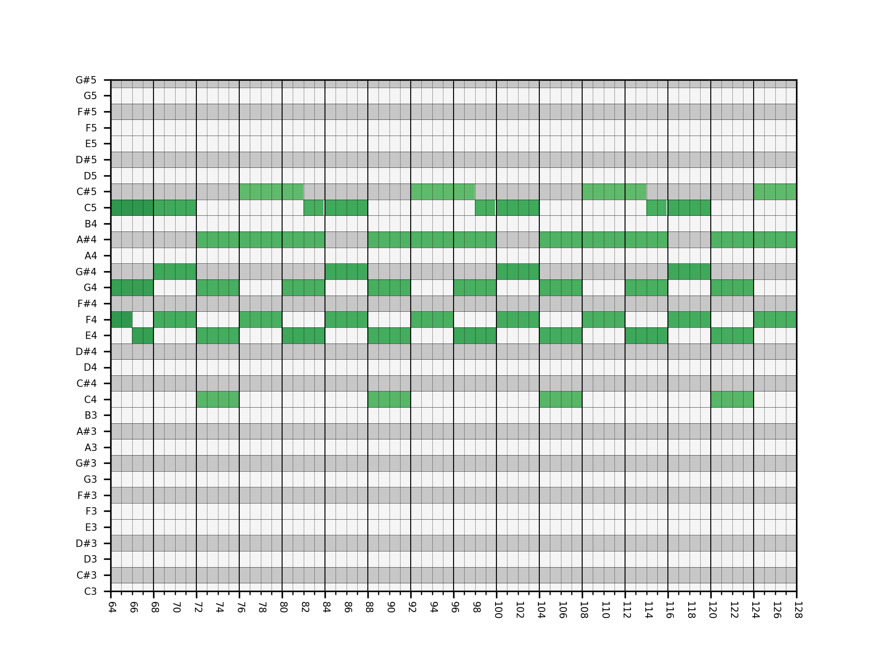
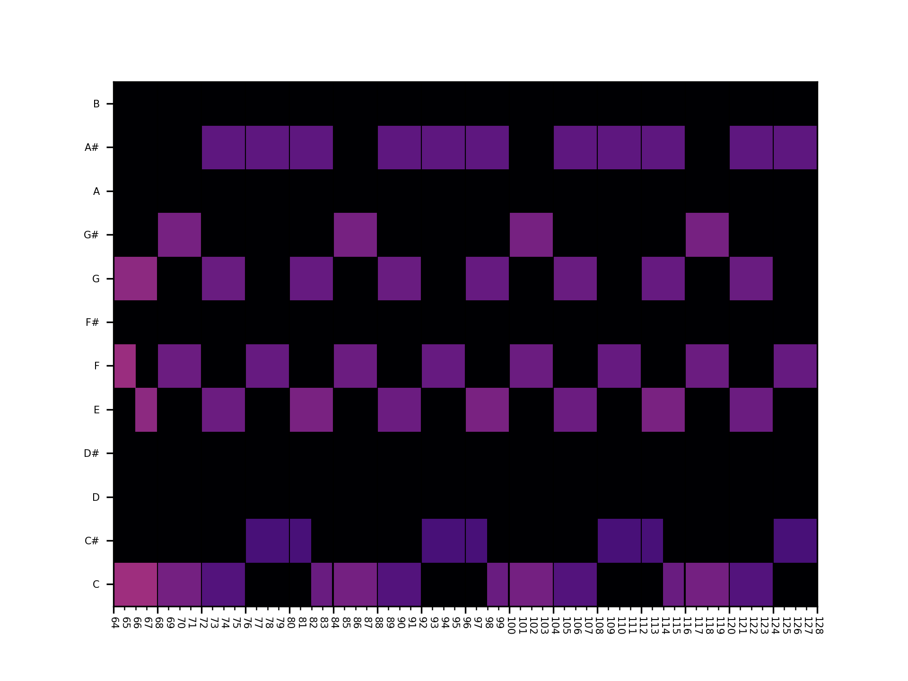

# miditoolkit
Python package for midi/piano-roll manipulation, conversion and visualization.


## Installation
The latest release (v0.0.4) is available on PyPI

```
pip install miditoolkit
```

## Usage

Please refer to [manual.py](manual.py)
## Functions

### midi

Codes here are modified from [pretty_midi](https://github.com/craffel/pretty-midi). To obtain the midi information faithfully, I choose to preserve the original design of time (symbolic, ticks per beat).

The same as pretty_midi, the parser wraps midi events into containers. Delta timing is transformed into absolute timing. Finally, if one track with multiple channel and program number, they will be splitted into individual tracks.


### pianoroll

* Piano roll (pitch number & downbeat)


* Piano roll  (pitch name & beat)


* Chromagram


### analyzer
***Warning: under construction***

